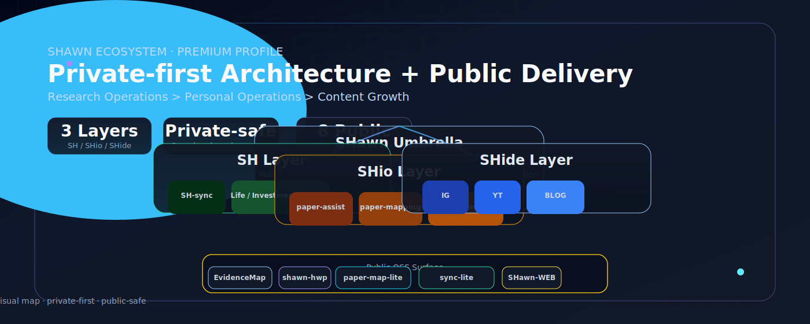
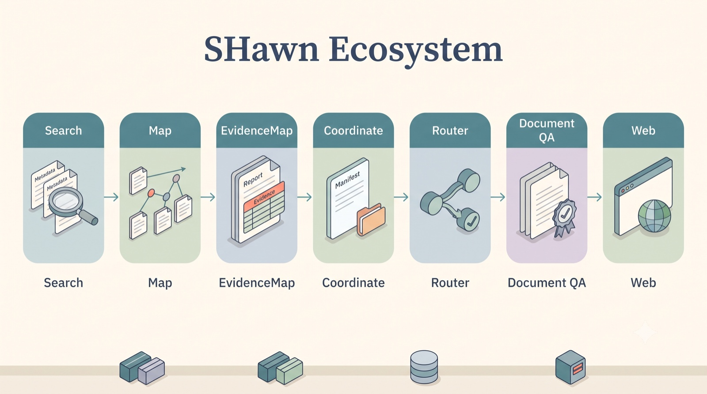

# SHawn Ecosystem

  

  
  
  

  <i>연구 근거에서 서비스 전달까지, 하나로 이어지는 SHawn 생태계</i>

---

## 01. Ecosystem Map

  

공개 레포의 README에 명시된 역할을 기준으로, 이 맵은 다음 흐름을 보여줍니다.
**Search → Map → EvidenceMap → Coordinate → Router → Document QA → Web**

이는 공개 OSS 참조 스택의 역할 지도이며, 모든 단계를 하나의 자동 실행 경로로 주장하지는 않습니다.

---

## 02. Public Stack Roles

| Map stage | Public module | Role stated in its README |
|---|---|---|
| Search | [shawn-bio-search-lite](https://github.com/L-SHawn91/shawn-bio-search-lite) | Public scholarly metadata adapters |
| Map | [paper-map-lite](https://github.com/L-SHawn91/paper-map-lite) | Claim/evidence graph schema |
| EvidenceMap | [SHawn-EvidenceMap](https://github.com/L-SHawn91/SHawn-EvidenceMap) | Evidence maps and public reports |
| Coordinate | [shawn-sync-lite](https://github.com/L-SHawn91/shawn-sync-lite) | Public-safe manifests and boundary templates |
| Router | [newbrain-router](https://github.com/L-SHawn91/newbrain-router) | Dry-run routing and approval-gate examples |
| Document QA | [SHawn-hwp](https://github.com/L-SHawn91/SHawn-hwp), [shawn-docx-qa](https://github.com/L-SHawn91/shawn-docx-qa) | Conversion and document structure QA |
| Web | [SHawn-WEB](https://github.com/L-SHawn91/SHawn-WEB) | Public hub and demo surface |

---

## 03. Ecosystem Modules

### 🔬 Research Intelligence
근거 수집과 지식 매핑을 담당하는 생태계의 입력단.
- [SHawn-EvidenceMap](https://github.com/L-SHawn91/SHawn-EvidenceMap) — 연구 근거 흐름 시각화
- [paper-map-lite](https://github.com/L-SHawn91/paper-map-lite) — 논문 지식 맵
- [shawn-bio-search-lite](https://github.com/L-SHawn91/shawn-bio-search-lite) — 바이오 문헌 검색

### 📄 Document QA
연구 산출물을 문서로 정제하는 품질 계층.
- [SHawn-hwp](https://github.com/L-SHawn91/SHawn-hwp) — HWP 문서 처리
- [shawn-docx-qa](https://github.com/L-SHawn91/shawn-docx-qa) — DOCX 품질 검증

### 🔀 Orchestration
모듈 간 라우팅과 동기화를 담당하는 연결 계층.
- [newbrain-router](https://github.com/L-SHawn91/newbrain-router) — 지능형 라우팅
- [shawn-sync-lite](https://github.com/L-SHawn91/shawn-sync-lite) — 생태계 동기화 규약

### 🌐 Service
생태계 산출물이 사용자에게 닿는 전달 계층.
- [SHawn-WEB](https://github.com/L-SHawn91/SHawn-WEB) — 웹 서비스 진입점

---

## 04. Ecosystem Principles

- **Public reference stack**: Search → Map → EvidenceMap → Coordinate → Router → Document QA → Web 역할이 공개 README에 명시됨.
- **Composable modules**: 각 모듈은 독립 실행 가능하되 공통 규약으로 상호 연동.
- **Evidence-first**: 모든 산출물은 추적 가능한 근거 위에서 생성.

---

## 05. Quick Links

- [🔬 EvidenceMap Demo](https://l-shawn91.github.io/SHawn-EvidenceMap/)
- [🌐 SHawn-WEB](https://shawnlab.vercel.app)
