# SHawn / SHawn Ecosystem

  

  
  
  

  
  
  

  <i>Private-safe architecture, 공개 가능한 산출물을 중심으로 정리한 SHawn 생태계 지도</i>

---

## 01) Architecture Snapshot

```mermaid
flowchart TB
    A["SHawn\nUmbrella"]

    A --> B["SH\nPersonal layer"]
    A --> C["SHio\nResearch layer"]
    A --> D["SHide\nContent & Growth layer"]

    B --> B1["SH-sync\nprivate control plane"]
    B --> B2["Private domains\n(real estate, investment, career)"]

    C --> C1["paper-assist\n(private)"]
    C --> C2["paper-mapping\n(private)"]
    C --> C3["academic-research\n(private)"]

    D --> D1["SHide-IG\n(private)"]
    D --> D2["SHide-YT\n(private)"]
    D --> D3["SHide-BLOG\n(private)"]

    A --> O["Public OSS Surface"]
    O --> O1["SHawn-EvidenceMap"]
    O --> O2["SHawn-hwp"]
    O --> O3["SHawn-WEB"]
    O --> O4["newbrain-router"]
    O --> O5["shawn-docx-qa"]
    O --> O6["paper-map-lite"]
    O --> O7["shawn-sync-lite"]
    O --> O8["shawn-bio-search-lite"]

    classDef core fill:#111827,color:#E2E8F0,stroke:#60A5FA,stroke-width:2px;
    classDef layer fill:#1E293B,color:#E2E8F0,stroke:#34D399,stroke-width:1.5px;
    classDef private fill:#1f1b3d,color:#E9D5FF,stroke:#C4B5FD,stroke-dasharray:6 4,stroke-width:1.5px;
    classDef public fill:#1f2937,color:#FEF08A,stroke:#FDE68A,stroke-width:1.5px;

    class A core
    class B,C,D layer
    class B1,B2,C1,C2,C3,D1,D2,D3 private
    class O,O1,O2,O3,O4,O5,O6,O7,O8 public
```

---

## 02) 공개 레포 (Public Repos)

| Domain | Repositories | 한 줄 요약 |
|---|---|---|
| **Research / Knowledge Infra** | [SHawn-EvidenceMap](https://github.com/L-SHawn91/SHawn-EvidenceMap), [paper-map-lite](https://github.com/L-SHawn91/paper-map-lite), [shawn-bio-search-lite](https://github.com/L-SHawn91/shawn-bio-search-lite) | 연구 산출물의 증거 흐름과 지식 맵을 가볍게 운영 |
| **Document QA** | [SHawn-hwp](https://github.com/L-SHawn91/SHawn-hwp), [shawn-docx-qa](https://github.com/L-SHawn91/shawn-docx-qa) | 문서 변환·품질 검증·포맷 정합성 자동화 |
| **Tools / Orchestration** | [newbrain-router](https://github.com/L-SHawn91/newbrain-router), [shawn-sync-lite](https://github.com/L-SHawn91/shawn-sync-lite) | 라우팅/동기화 규약 모듈 |
| **Service / Web** | [SHawn-WEB](https://github.com/L-SHawn91/SHawn-WEB) | 운영형 웹 체계 및 대시보드 진입점 |

---

## 03) 운영 원칙

- **Layered-by-Domain**: SH / SHio / SHide의 분리 원칙을 유지
- **Public-safe by default**: 대외 공개 항목은 경계를 명확히 분리
- **Reusable & composable**: 연구/문서/오케스트레이션 모듈을 독립 컴포넌트로 공개

---

## 04) Quick Links

- [🔬 EvidenceMap Demo](https://l-shawn91.github.io/SHawn-EvidenceMap/)
- [🌐 SHawn-WEB](https://shawnlab.vercel.app)
- [📬 제어면(프레임)](https://github.com/L-SHawn91/SH-sync) · [학습/연구 제어면](https://github.com/L-SHawn91/SHio-sync) · [수익/콘텐츠 제어면](https://github.com/L-SHawn91/SHide-sync)

---

Public profile surface only — private layer state is preserved in control-plane repos.

