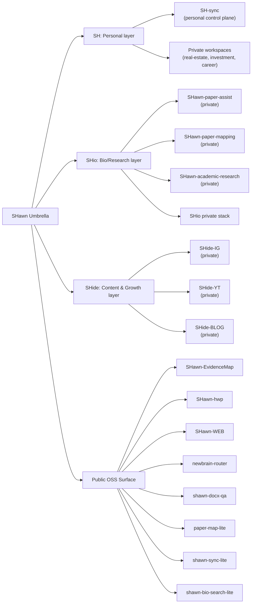

# Hi, I'm **SHawn** 👋

## 숀 생태계 (SHawn) — GitHub 대표 지도

  
  
  

### Public repos

- **Research / Knowledge Infra**
  - [SHawn-EvidenceMap](https://github.com/L-SHawn91/SHawn-EvidenceMap)
  - [paper-map-lite](https://github.com/L-SHawn91/paper-map-lite)
  - [shawn-bio-search-lite](https://github.com/L-SHawn91/shawn-bio-search-lite)
- **Document QA / Automation**
  - [SHawn-hwp](https://github.com/L-SHawn91/SHawn-hwp)
  - [shawn-docx-qa](https://github.com/L-SHawn91/shawn-docx-qa)
- **Tools / Router / Orchestration**
  - [newbrain-router](https://github.com/L-SHawn91/newbrain-router)
  - [shawn-sync-lite](https://github.com/L-SHawn91/shawn-sync-lite)
- **Web / Service**
  - [SHawn-WEB](https://github.com/L-SHawn91/SHawn-WEB)

### Quick Links

- 🔬 [EvidenceMap Demo](https://l-shawn91.github.io/SHawn-EvidenceMap/)
- 🌐 [SHawn-WEB](https://shawnlab.vercel.app)
- 📬 더 자세한 제어면: `SH-sync`, `SHio-sync`, `SHide-sync` (private)

### Focus Areas

- **오픈소스 배포**: 연구·문서 QA·오케스트레이션 엔진의 공개 컴포넌트 정리
- **생태계 경계 정책 준수**: SH / SHio / SHide의 private/public 경계 유지
- **실험 자동화 친화적 구조**: 공통 실행 규약, 모듈형 연결, 문서화 우선

### Visual Principles

- **Layered by domain** (SH / SHio / SHide)
- **Public-safe + private-first design**
- **Reproducible tooling** for document QA and evidence workflows
- **No leakage** of private-layer state

---

Public profile surface only. Internal layer state is maintained in control-plane repos.

