# SHawn Ecosystem Profile

  

  
  
  

  
  
  

  <i>생태계 경계(SH / SHio / SHide)는 유지하되, 공개 가능한 공개 산출물만 고해상도 맵으로 정리한 프로필</i>

---

## 01. 시스템 맵

```mermaid
flowchart TB
    A["SHawn Ecosystem<br/>Umbrella"]

    A --> B["SH\nPersonal Operations"]
    A --> C["SHio\nResearch"]
    A --> D["SHide\nContent Growth"]

    B --> B1["SH-sync\nprivate control plane"]
    B --> B2["라이프\n투자\n커리어"]

    C --> C1["paper-assist\nprivate"]
    C --> C2["paper-mapping\nprivate"]
    C --> C3["academic-research\nprivate"]

    D --> D1["SHide-IG\nprivate"]
    D --> D2["SHide-YT\nprivate"]
    D --> D3["SHide-BLOG\nprivate"]

    A --> O["Public OSS Surface"]
    O --> O1["SHawn-EvidenceMap"]
    O --> O2["SHawn-hwp"]
    O --> O3["SHawn-WEB"]
    O --> O4["newbrain-router"]
    O --> O5["shawn-docx-qa"]
    O --> O6["paper-map-lite"]
    O --> O7["shawn-sync-lite"]
    O --> O8["shawn-bio-search-lite"]

    classDef core fill:#0f172a,stroke:#60a5fa,color:#f8fafc,stroke-width:2.5px;
    classDef layer fill:#111827,stroke:#34d399,color:#e2e8f0,stroke-width:1.6px;
    classDef private fill:#181132,stroke:#a78bfa,color:#ede9fe,stroke-width:1.4px,stroke-dasharray:5 4;
    classDef public fill:#111827,stroke:#fde047,color:#fef3c7,stroke-width:1.4px;

    class A core
    class B,C,D layer
    class B1,B2,C1,C2,C3,D1,D2,D3 private
    class O,O1,O2,O3,O4,O5,O6,O7,O8 public
```

---

## 02. 공개 레포

### Research / Knowledge Infrastructure
- [SHawn-EvidenceMap](https://github.com/L-SHawn91/SHawn-EvidenceMap)
- [paper-map-lite](https://github.com/L-SHawn91/paper-map-lite)
- [shawn-bio-search-lite](https://github.com/L-SHawn91/shawn-bio-search-lite)

### Document QA & Automation
- [SHawn-hwp](https://github.com/L-SHawn91/SHawn-hwp)
- [shawn-docx-qa](https://github.com/L-SHawn91/shawn-docx-qa)

### Router / Orchestration Layer
- [newbrain-router](https://github.com/L-SHawn91/newbrain-router)
- [shawn-sync-lite](https://github.com/L-SHawn91/shawn-sync-lite)

### Service
- [SHawn-WEB](https://github.com/L-SHawn91/SHawn-WEB)

---

## 03. 운영 철학

- **Private-first boundary**: 내부 데이터/전략은 비공개, 외부 노출은 오픈 소스/협업 중심.
- **Composable design**: 공개 레이어는 독립 모듈처럼 연결.
- **Evidence-ready structure**: 산출물과 규약을 한눈에 연결 가능한 구조로 설계.

---

## 04. Quick Links

- [🔬 EvidenceMap Demo](https://l-shawn91.github.io/SHawn-EvidenceMap/)
- [🌐 SHawn-WEB](https://shawnlab.vercel.app)
- 제어면: `SH-sync`, `SHio-sync`, `SHide-sync`

Public profile surface only. Internal state maintained in control-plane repos.

